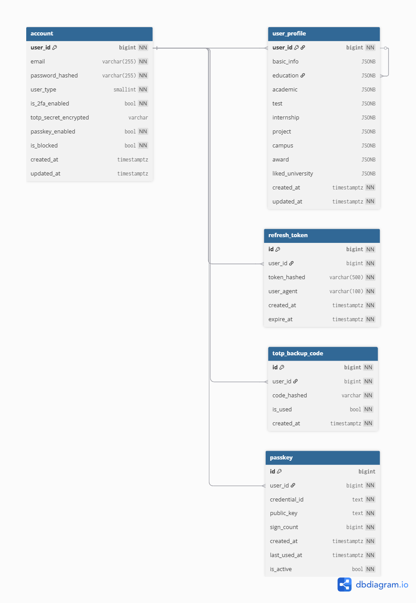

# U Finder
🌍 [English](README.md) | **简体中文** | [繁體中文](README_zh_tw.md)

## 项目简介

U Finder 是一个基于大语言模型（LLM）的智能大学推荐系统。该系统通过分析用户的学习背景、兴趣爱好、职业规划等多维度信息，利用先进的LLM技术为用户提供个性化的大学推荐服务。

## 主要特性

- 🤖 **智能推荐**: 基于LLM的智能分析，提供精准的大学匹配建议
- 💬 **简单直观**: 可用自然语言直接向AI进行提问，无需进行复杂筛选
- 📊 **数据可视化**: 直观展示大学信息和对比分析
- ⚡ **高性能**: 基于FastAPI的高性能后端API
- 🎨 **现代化UI**: 采用Vue 3构建的响应式前端界面
- � **安全保障**: 双因素认证 (2FA)、Passkey/WebAuthn、Cloudflare Turnstile
- 🛡️ **管理员仪表盘**: 用户管理、LLM 成本监控、系统日志
- 💾 **可靠存储**: PostgreSQL + Redis 确保数据安全与高性能

## 技术架构

### 后端技术栈
- **框架**: FastAPI
- **数据库**: PostgreSQL
- **缓存**: Redis
- **LLM集成**: Dify
- **认证**: JWT + TOTP 2FA + Passkey/WebAuthn
- **反机器人**: Cloudflare Turnstile
- **部署**: Docker + GitHub Actions CI/CD

### 前端技术栈
- **框架**: Vue 3 + Composition API
- **构建工具**: Vite
- **UI组件库**: shadcn-vue
- **状态管理**: Pinia
- **路由**: Vue Router
- **HTTP客户端**: Axios

## 快速开始

### 后端设置

1. 克隆仓库（含子模块）：

```bash
git clone --recursive https://github.com/GRP-Team202511/u-finder
cd u-finder/backend
```

2. 创建并激活虚拟环境：

```bash
python -m venv venv

# Windows
venv\Scripts\activate

# macOS / Linux
source venv/bin/activate
```

3. 安装依赖：

```bash
pip install -r requirements.txt
```

4. 配置环境变量：

```bash
cp .env.example .env
# 编辑 .env，填入数据库、Redis、Dify 和 SMTP 凭据
```

5. 通过 Docker Compose 启动 PostgreSQL 和 Redis：

```bash
docker compose up -d
```

6. 启动开发服务器：

```bash
python run.py
```

API 将在 `http://localhost:8000` 上可用。

更多详情请参阅[后端 README](backend/README.md)。

### 前端设置

1. 确保已安装 **Node.js**（v18+）和 **pnpm**（v8+）：

```bash
npm install -g pnpm
```

2. 进入前端用户应用目录并安装依赖：

```bash
cd frontend/u-finder
pnpm install
```

3. 启动开发服务器：

```bash
pnpm dev
```

应用程序将在 `http://localhost:5173` 上可用。

管理员面板请参阅 `frontend/u-finder-admin/`。

更多详情请参阅[前端 README](frontend/README.md)。

## 数据库文档

[`docs/database`](docs/database) 目录包含完整的数据库架构文档：

- **SQL文件**: 完整的数据库表结构定义
- **ER图**: [📊 查看交互式ER图](https://dbdiagram.io/e/69ae7a43cf54053b6f39329c/69afe47277d079431b482ce0)



## 许可证

本项目基于 [Apache License 2.0](LICENSE) 许可证开源。